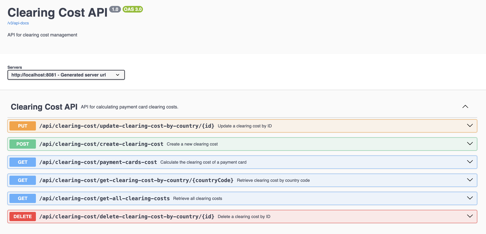

# Card Cost API

A RESTful API for managing clearing costs and calculating the cost associated with a specific card number using data from the public [Binlist](https://binlist.net/) API.




---

## Features

1. **Complete CRUD Operations**:
   - Create, Read, Update, and Delete clearing costs.

2. **Integration with Binlist**:
   - Fetch issuer country data using the Binlist API to calculate costs dynamically.

3. **Documentation**:
   - Swagger UI is included for testing and understanding the API endpoints.

4. **Database**:
   - Uses H2 (in-memory) for local development and testing. It can be extended to PostgreSQL or other relational databases.
  
     [](https://mermaid.live/edit#pako:eNp1VMGO2jAQ_RXLvbASSyFkgeRQCRZaqHYrCrSHNj2YZABrjc3aTheK-PdOHCABWp_smTdvxvPG3tNYJUBDuhDqLV4xbcmsH0li0vlSs82KjKQFLcH-jOij4CBtRH-h_7hyE_qmb2y5BH139IJMyiQ9Fr-gyXEA01wuyaMylnTHo0s6Ja1WQoAuQTNk4SCVyWA6KyHvLhimoH_zGK7Cj9YcUumlhkswhjypJY8v4yewUYZbpXdXFIXjyPJ53C2hL1kG2xg2lis5ZDLJb_NJqDkT145axjTQWmniLJjsPy3sM8vmzGQ3O21JhQy998-76au4akK8gjW7ugCZsbmAf5MPtpnITBTdm3MpuLE1VP5GpV7uQzMCe6MvOCMLpdcsu9dJgIs850Eh9_dkOJuNsXGvKRhr0PChpOURW4iN-O9M8IRZMJhmk9oqmag0O11QnLLK0gxkwR_Bxjh-xxodtKj-Bt2N42wssv46aCFvDi3NAKK_pqA5mCpSG9AWN982eaGuIqdBHnetumuD2xrixL_tQx5o7E7A-QniUasXCN_V3cpAkaRVugZsPk_wEe-zsIhaTI0KhLhNYMFSgY82kgeEstSq6U7GNLQ6hSrVKl2uaLhgwuApdfX3OcOpWJ8gGyZ_KHU-QpI14Dn_NNzf4SA03NMtDb12pxZ4nUbL9xtBu-U1_Crd0bAR-LWO32oGXjPAyv3g4VClfxxrvdby6gECm17QbgQPfvPwF7W7fQs)

---

## Installation

### Prerequisites

- Java 17+
- Maven


### Steps

1. **Clone the Repository**:
   ```bash
   git clone https://github.com/your-username/card-cost-api.git
   cd card-cost-api
2. ./mvn-clean install
3. ./mvn spring-boot:run
4. Access Swagger UI:

Visit http://localhost:8081/swagger-ui.html to explore the API endpoints.

